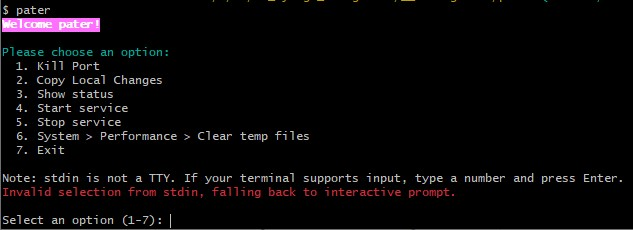

# pater
**`personal assistant in terminal` for devs, for recurring workflows.**
|  |
| -------------------------------------------- |


# <mark>how to use</mark>
1. for installation, run command `npm install -g @kundan100/pater`
2. for usage, run command `pater`.
3. few features run out of box without any configuration e.g.
    1. feature: kill port
    2. feature: System > Performance > Clear temp files
4. few features need some configuration (e.g.your project-local-path)
    1. feature: Copy Local Changes
3. done.


# feature list
1. kill port
    - when propmted, enter port-number and hit ENTER key.
2. System > Performance > Clear temp files
    - will clean temp files.
3. Copy Local Changes
    - use case: keep local changes in a local companion file and apply these changes in actual source file when needed.
    - In your repo, make a copy of any source file and rename that by adding a prefix `cykLocal__`.
    - You can gitignore/exclude this file from showing up in git-changes section.
    - update `.\config.js` and `.\src\features\copy-local-changes\local-changes-manifest.json` as explained in section `Project setup for local dev`
4. Show status
    - shows information (machine, processes, task-manager info  etc...)
5. Start service
6. Stop service


# command options
- Help:
```bash
pater --help
```

- Basic:
```bash
pater
# prints: Welcome cyk-pa!
```

- Version:
```bash
pater --version
```

- Config:
```bash
pater --config
# prints: info regarding this tool's config
```

- Echo (test arg forwarding):
```bash
pater --echo "hello"
# prints: hello
```

- Verbose (prints debug info to stderr):
```bash
pater --verbose --echo hi
# prints debug info to stderr then 'hi' to stdout
```

<details>
<summary>Dev Notes</summary>

### Project setup for local dev
1. clone the repo.
2. create a file (.env for local use only) in project root.
    1. add this line `NPM_TOKEN=your-npm-token-for-publishing`
3. Configuration before running (follow sample)
    1. app level configuration
        - update `.\config.js`
        - OPEN_CONFIG_FILE_WHILE_CHECKING_CONFIG
    2. feature level configuration
        - update `.\src\features\copy-local-changes\local-changes-manifest.json`
        - provide `repoRoot`
        - provide `files` (list of files) which needs to have local changes.
4. for local testing of changes (without publishing or install):
    1. run caommand `node index.js`, from project root.
5. done.

### <mark>Publish to npm</mark>
1. after clone on your local, make sure that your file (./.env) has npm-token.
2. for publishing:
    1. increase version number in package.json.
    2. run command (`npm run publish:env`)

### How to add new feature in this utility
1. Add a menu-option in file (`src\menu\menu.json`).
2. Create a utility (e.g. `src\features\system\clearTempFiles.js`)
3. Consume this newly created utility in file (`src\menu\index.js`)

</details>