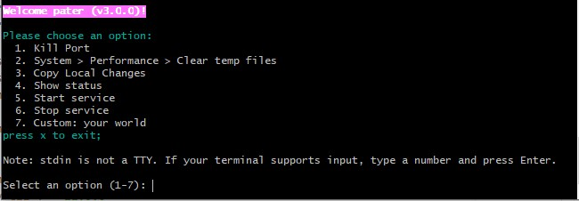

# pater
**`personal assistant in terminal` for devs, for recurring workflows.**
|  |
| -------------------------------------------- |


# <mark>how to use</mark>
1. for installation, run command `npm install -g @kundan100/pater`
2. for usage, run command `pater`.
3. few features run out of box without any configuration e.g.
    1. feature: kill port
    2. feature: System > Performance > Clear temp files
4. few features need some configuration (e.g.your project-local-path)
    1. feature: Copy Local Changes
3. you can also create your own custom-menu-item and link it to your-own-utility to run.


# feature list:
1. kill port
    - when propmted, enter port-number and hit ENTER key.
2. System > Performance > Clear temp files
    - will clean temp files.
3. Copy Local Changes
    - use case: keep local changes in a local companion file and apply these changes in actual source file when needed.
    - In your repo, make a copy of any source file and rename that by adding a prefix `cykLocal__`.
    - You can gitignore/exclude this file from showing up in git-changes section.
    - update `/config.json` and `/src/features/copyLocalChanges/copyLocalChangesConfig.json` as explained in section `Project setup for local dev`
4. Show status
    - shows information (machine, processes, task-manager info  etc...)
5. Start service
6. Stop service


# command options
- Help:
```bash
pater --help
```

- Basic:
```bash
pater
# prints: Welcome cyk-pa!
```

- Version:
```bash
pater --version
```

- Config:
```bash
pater --config
# prints: info regarding this tool's config
```

- Echo (test arg forwarding):
```bash
pater --echo "hello"
# prints: hello
```

- Verbose (prints debug info to stderr):
```bash
pater --verbose --echo hi
# prints debug info to stderr then 'hi' to stdout
```

<details>
<summary>Dev Notes</summary>

### Project setup for local dev
1. clone the repo.
2. create a file (.env for local use only) in project root.
    1. add these lines:
        - `NPM_TOKEN=your-npm-token-for-publishing`
        - `NODE_ENV=development`
    2. For `DEBUG_LOG_ENABLED` to work properly, `.env` file should exist (having code for `NODE_ENV`).
3. Configuration before running (follow sample)
    1. app level configuration
        - update file `/config.json` for below items:
        - `OPEN_CONFIG_FILE_WHILE_CHECKING_CONFIG`
        - `DEBUG_LOG_ENABLED`
    2. configuration for shadowing file at local machine
        - update file `/src/features/shadowManager/shadowManager.json`
    3. feature level configuration (e.g. for copyLocalChanges)
        - update `/src/features/copyLocalChanges/copyLocalChangesConfig.json`
        - provide `repoRoot`
        - provide `files` (list of files) which needs to have local changes.
4. for local testing of changes (without publishing or install):
    1. `index.js` is the entry point for this project. run caommand `npm start` or `dotenv -e .env -- node index.js` (from project root) to run this project locally.
5. done.

### <mark>Publish to npm</mark>
1. after clone on your local, make sure that your file (./.env) has npm-token.
2. for publishing:
    1. increase version number in package.json.
    2. run command (`npm run publish:env`)

### How to add new feature in this utility (through code)
1. Add a menu-option in file (`src/menu/menuConfig.json`).
2. Create a utility (e.g. `src/features/system/clearTempFiles.js`)
3. Consume this newly created utility in file (`src/menu/index.js`)

### How to add new feature in this utility (through json configuration only)
1. Add a menu-option in file (`src/menu/menuConfig.json`).
2. Create an utility on your local machine.
3. connect this (your local utility) with menu-option.
```
{
			"key": "custom_your_world",
			"label": "Custom: your world",
			"enabled": true,
			"action": {
			"sourceType": "localMachine",
			"sourceType__note": {
				"localMachine": "Script should be present on the user's local machine at the specified sourcePath.",
				"projectScope": "Script should be present within the project directory at the specified sourcePath."
			},
			"sourceBase": "userHomePath",
			"sourceBase__note": {
				"userHomePath": "Script path is relative to the user's home directory (C:/Users/<user-name>).",
				"projectRoot": "Script path is relative to the project root directory."
			},
			"sourceScript": "/__cyk/util_scripts/printHi/index.js"
			}
		}
```

### Code workflow
1. `index.js` is the entry point for this project.
    1. run any command (from project root), to run this project locally:
        - `npm start` / `dotenv -e .env -- node index.js`
        - `npm start -- --config`
2. `.env` is loaded using npm `dotenv-cli`.
    1. refer package.json script e.g. `"start": "dotenv -e .env -- node index.js",`
3. `handleArgs` is called.
    1. if args are passed then according to args it calls `printHelp`, `printVersion`, etc.
    2. if args are not passed, it calls `handleMenu`.
4. On first install, manage config files as shadow into local machine
5. 

### Best practices followed
1. In file `package.json`, define `internal import aliases`.
    1. It solves the classic "relative path hell".
    2. consume it like `const pkg = require('#root/package.json');` from any part of the code.
```
"imports": {
    "#root/*": "./*",
    "#shared/*": "./src/shared/*.js",
    "#features/*": "./src/features/*.js",
    "#menu/*": "./src/menu/*.js",
    "#args/*": "./src/args/*.js"
},
```
2. 

### Code flow diagram
**create a code flow diagram for devs to understand the whole codebase and connections between different files**


</details>